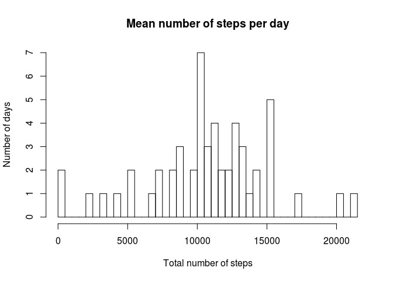
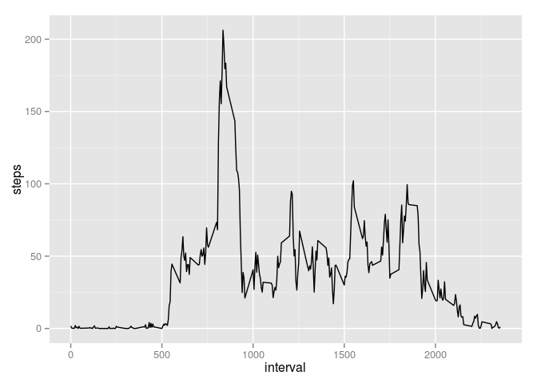
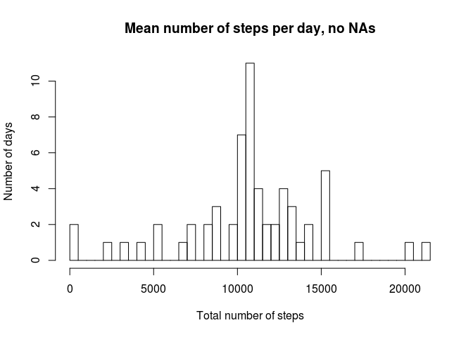
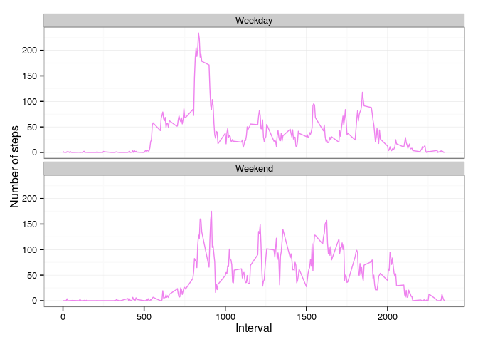

# Reproducible Research: Peer Assessment 1


## Loading and preprocessing the data
The repository came with zipped data. First of all, unzip csv file, load it and have a look at it, to be sure the dates and other variables are in the right format.


```r
unzip("./activity.zip")
activity <- read.csv("./activity.csv", colClasses = c("numeric", "Date", "factor"))
summary(activity)
```

```
##      steps             date               interval    
##  Min.   :  0.00   Min.   :2012-10-01   0      :   61  
##  1st Qu.:  0.00   1st Qu.:2012-10-16   10     :   61  
##  Median :  0.00   Median :2012-10-31   100    :   61  
##  Mean   : 37.38   Mean   :2012-10-31   1000   :   61  
##  3rd Qu.: 12.00   3rd Qu.:2012-11-15   1005   :   61  
##  Max.   :806.00   Max.   :2012-11-30   1010   :   61  
##  NA's   :2304                          (Other):17202
```

```r
str(activity)
```

```
## 'data.frame':	17568 obs. of  3 variables:
##  $ steps   : num  NA NA NA NA NA NA NA NA NA NA ...
##  $ date    : Date, format: "2012-10-01" "2012-10-01" ...
##  $ interval: Factor w/ 288 levels "0","10","100",..: 1 226 2 73 136 195 198 209 212 223 ...
```
Everything looks ok, we have number of steps as numeric values, dates represented in date format and interval variable is as factor. This will speed up the rest of computations. There is also 2304 NA's, but we will deal with it later.


## What is mean total number of steps taken per day?
Lets calculate the mean number of steps for each day, and save it to new data frame. Plot a histogram to visualize the result. 

```r
stepsMean <- aggregate(steps ~ date, data = activity, sum, na.rm=TRUE)
hist(stepsMean$steps, breaks=50, main="Mean number of steps per day", xlab="Total number of steps", ylab="Number of days")
```

 

```r
## calculate the mean and median of the total number of steps taken per day
meanSteps <- as.character(mean(stepsMean$steps))
medianSteps <- as.character(median(stepsMean$steps))
```

The mean of the total number of steps taken per day is **10766.1886792453**, and median is **10765**.


## What is the average daily activity pattern?
Lets do some computation, shall we? After it's done, plot the result, to see whats the pattern like throughout a day.

```r
dailyPattern <- aggregate(steps ~ interval, data = activity, FUN = mean)

## we have to convert intervals to integer, otherwise it will not plot well..
library(ggplot2)
dailyPattern$interval <- as.integer(levels(dailyPattern$interval)[dailyPattern$interval])
ggplot(data=dailyPattern, aes(x=interval, y=steps)) +
        geom_line()
```

 

## Imputing missing values

Lets calculate number of missing values.

```r
missingValues <- sum(is.na(activity$steps))
```

We have **2304** missing values in the dataset.
Lets do something about them. We will create new dataset, a copy of our original activity, and replace missing values of steps with mean number of steps in that time interval.


```r
activity2 <- activity
index <- as.numeric(length(activity2$steps))
for(i in 1:index){
        if(is.na(activity2$steps[i])){
                activity2$steps[i] <-  dailyPattern[activity2[i, 3], 2]
        }
}
```

Calculate again mean and median for updated dataset. Print a histogram for it.


```r
stepsMean2 <- aggregate(steps ~ date, data = activity2, sum)
meanSteps2 <- as.character(mean(stepsMean2$steps))
medianSteps2 <- as.character(median(stepsMean2$steps))
hist(stepsMean2$steps, breaks=50, main="Mean number of steps per day, no NAs", xlab="Total number of steps", ylab="Number of days")
```

 

In original dataset mean was **10766.1886792453**.
Without NAs dataset mean is **10766.1886792453**.

In original dataset median was **10765**.
Without NAs dataset median is **10766.1886792453**.

As You can see, the median value has shifted up. But the impact on predictions is minimal.


## Are there differences in activity patterns between weekdays and weekends?

To answear this question, we need to divide the dataset into two levels - the weekdays and weekends.


```r
day <- weekdays(activity$date)
daylevel <- vector()
for (i in 1:nrow(activity)) {
    if (day[i] == "Saturday") {
        daylevel[i] <- "Weekend"
    } else if (day[i] == "Sunday") {
        daylevel[i] <- "Weekend"
    } else {
        daylevel[i] <- "Weekday"
    }
}
activity$daylevel <- daylevel
activity$daylevel <- factor(activity$daylevel)

stepsByDay <- aggregate(steps ~ interval + daylevel, data = activity, mean)
names(stepsByDay) <- c("interval", "daylevel", "steps")

stepsByDay$interval <- as.integer(levels(stepsByDay$interval)[stepsByDay$interval])
ggplot(stepsByDay, aes(x=interval, y=steps)) + 
        geom_line(color="violet") + 
        facet_wrap(~ daylevel, nrow=2, ncol=1) +
        labs(x="Interval", y="Number of steps") +
        theme_bw()
```

 

As we can see during the weekdays there is a greatest peek, no such thing during weekends. But weekends have higher level of activities (peaks reaching above 100). This can be related to work routine and more active live style in a free time. 
